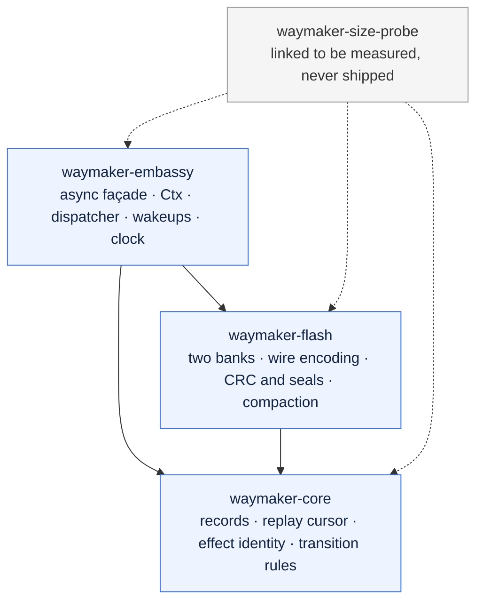
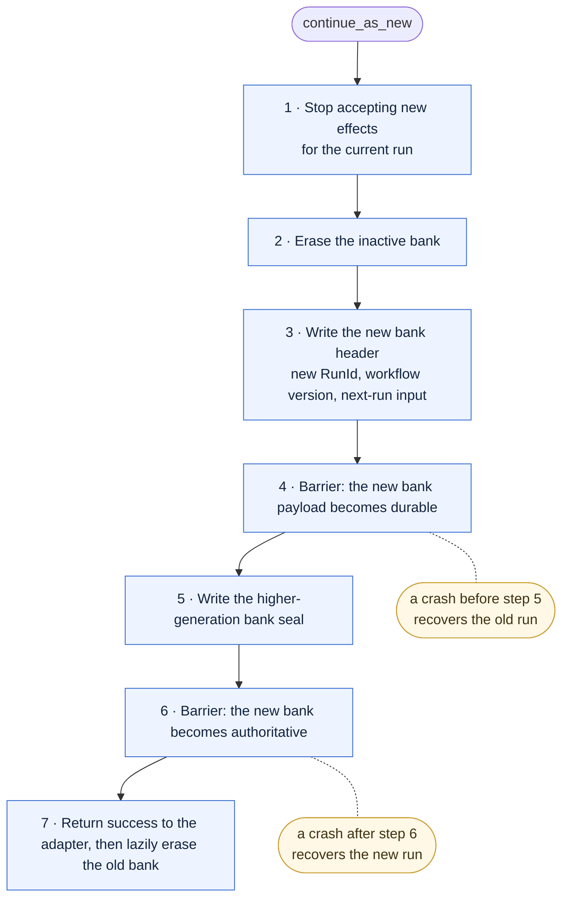
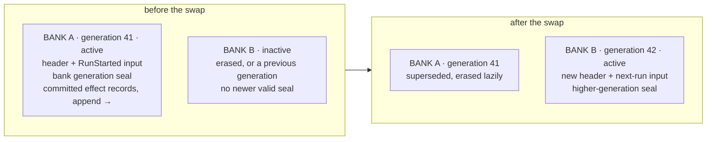

# Architecture

Five diagrams, drawn from the design document. Each carries an HTML comment label that
`cargo xtask check-layering` reads, and each is checked against the table that owns the
same facts — so a diagram cannot quietly fall behind the code it draws.

| Diagram | Design document | Checked against |
| --- | --- | --- |
| [Crate dependency flow](#crate-dependency-flow) | §05 Architecture | `xtask::policy::LAYERS` |
| [Durable effect protocol](#durable-effect-protocol) | §07 Durable effect protocol | `xtask::docs::EFFECT_PROTOCOL_STEPS` |
| [Record frame](#record-frame) | §09 Journal and wire format | `xtask::docs::RECORD_FRAME_FIELDS` |
| [Two-bank swap](#two-bank-swap) | §10 Two-bank lifecycle | `xtask::docs::TWO_BANK_SWAP_STEPS` |
| [The banks before and after](#two-bank-swap) | §10 Two-bank lifecycle | `xtask::docs::DIAGRAMS` |

The check is a text scan, not a Mermaid implementation. It proves that every crate, every
permitted edge and every protocol step the tables name appears in the right block, that a
step listed twice is drawn twice, and that no edge contradicts the layering. It reads only
what a reader sees: an indented fence, a fence quoted inside a longer one, and a Mermaid
`%%` comment are all text rather than picture, and satisfy nothing. It does not prove the
diagram renders, which is what the preview in a pull request is for.

## Crate dependency flow

Arrows point the way `Cargo.toml` does: a crate points at what it depends on. Every solid
arrow below is one `may_depend_on` entry in `xtask::policy::LAYERS`, and the gate compares
them one for one — add a fourth layer to that table and the build fails until its edge is
drawn here.

`waymaker-core` points at nothing at all: not at another layer, and not at a registry
crate. Nothing points down into `waymaker-embassy`.

`waymaker-size-probe` is in the picture because it is a real crate CI links on every pull
request and on every push to `main`, but it is not a layer: it declares all three as
*optional* dependencies, so that a variant linking none of them gives the baseline the
code-flash budget is a delta against, and nothing depends on it. Its edges are dashed for
that reason, and the gate ignores dashed edges — the contract is the solid ones.

<!-- diagram: crate-dependency-flow -->

What each layer must not own is the other half of the contract, and it lives in
[CLAUDE.md](../CLAUDE.md#the-must-not-own-table).

## Durable effect protocol

Design document §07. The first execution of an activity is an ordered protocol with two
barriers per committed record: a **payload barrier** stops a seal becoming durable ahead of
the frame it seals, and a **commit barrier** proves the seal itself is durable before the
next irreversible action.

The tag beside each step is the state the system is in *after* it — what is true if power
fails there.

<!-- diagram: durable-effect-protocol -->

Step 4 is the one that cannot be made atomic. Power can fail after the activity has changed
the world and before its outcome is committed, so Waymaker redelivers the same stable
effect id. **There is no exactly-once physical promise**: exactly-once behavior needs an
idempotent activity, or a downstream system that deduplicates that id.

## Record frame

Design document §09. The unit a journal is made of: handwritten, fixed-endian,
self-delimiting, and independent of Rust layout. User payload bytes are opaque to the
kernel, which is why the whole of this picture lives in `waymaker-flash` and none of it in
`waymaker-core`.

Two checksums rather than one, and the order they are checked in is the point. `header_crc`
covers the twelve bytes before it, so `payload_len` is known to be the number the writer
wrote **before** it is used to find where the frame ends — which is what §09's "all lengths
are validated against caller buffers and bank bounds before reading" asks for. A single
checksum over the whole frame could not: finding it would mean trusting the length first.

<!-- diagram: record-frame -->

`payload_crc` is §09's name for the field and `frame_crc` is what `waymaker-flash` calls it,
because it covers the header as well as the payload: that binds a payload to its header,
and it stops a record with an empty payload having a checksum of zero, which a zeroed page
would satisfy. `commit_seal` is a storage-program unit rather than a field, written after a
barrier, and it is what makes a frame *committed* rather than merely present — which is why
it hangs off the picture rather than sitting in it. It arrives with the barrier protocol at
rung 0.2. Until then the append scan treats a frame whose checksums hold as history, so a
torn write at the tail of a journal is not distinguishable from damage there. Both stop the
scan in the same place, which is what §14 requires either way.

Everything after the frame is padding, up to the device's program granularity from §12's
`Geometry`. It is written as `0xFF`, which an erased NOR cell already holds, and it is never
interpreted: the decoder reports the frame's own length, and the scan is what applies the
stride.

## Two-bank swap

Design document §10. Two fixed storage banks, usually one erase block each. The bank with
the highest valid generation seal is authoritative; its journal is then scanned to the last
valid committed record.

`continue_as_new` is the only way bounded history is reclaimed, and the workflow explicitly
supplies the bounded input for its next run — nothing serializes a suspended future.

<!-- diagram: two-bank-swap -->

Recovery never combines the two runs' footprints. The generation seal written at step 5 is
what makes the new bank authoritative, and it is written only once the payload it seals is
already durable.

The banks themselves, before and after:

<!-- diagram: two-bank-generations -->

Capacity is explicit. Waymaker reserves enough tail space for a terminal record or a
`continue_as_new`, so ordinary effect scheduling fails early with `HistoryNearCapacity`; the
runtime never overwrites committed history to make room.

## See also

- [CLAUDE.md](../CLAUDE.md) — the invariants and layering rules a contributor works to.
- [The decision record](adr/README.md) — why each of these is the way it is.
- [The design document](design/waymaker-design-v0.2.html) — the source these diagrams draw.
