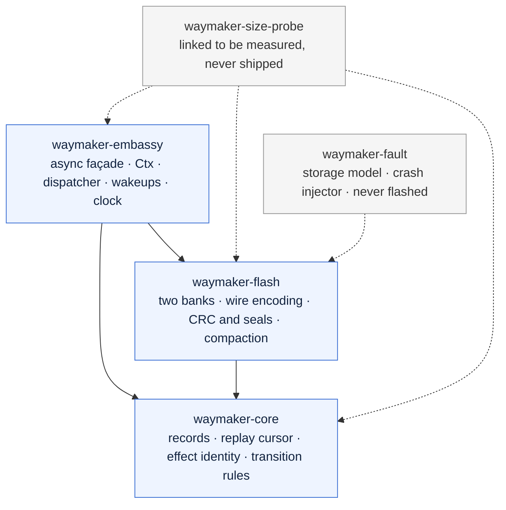
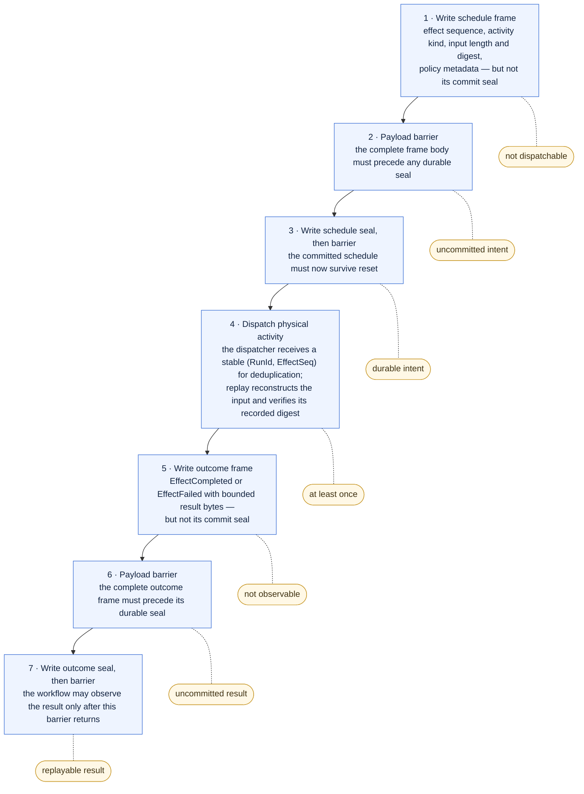
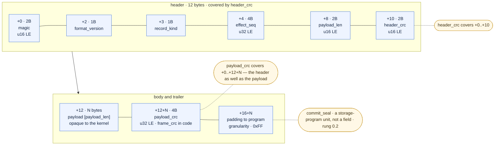
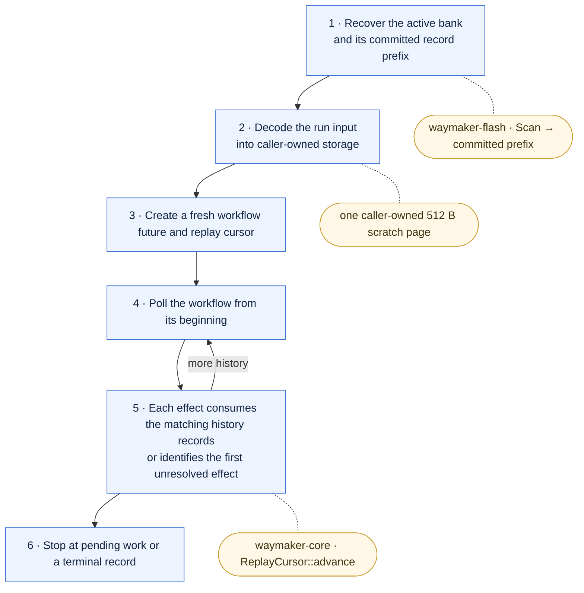
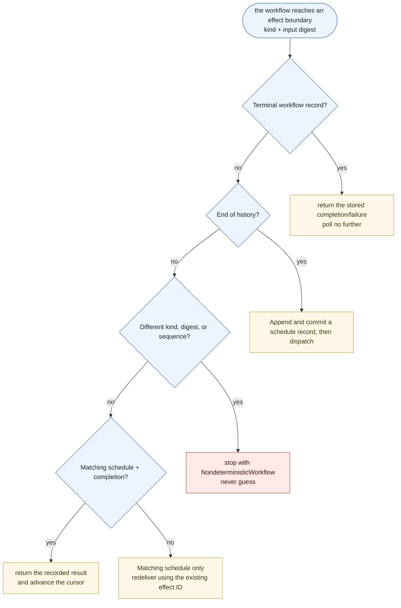
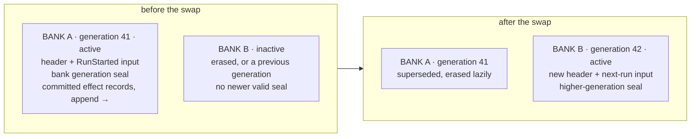
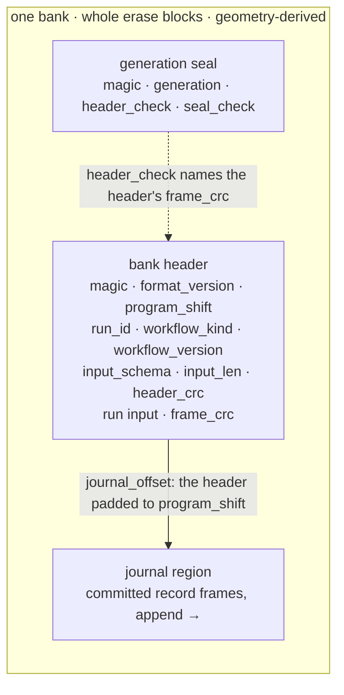

# Architecture

Seven diagrams, drawn from the design document. Each carries an HTML comment label that
`cargo xtask check-layering` reads, and each is checked against the table that owns the
same facts — so a diagram cannot quietly fall behind the code it draws.

| Diagram | Design document | Checked against |
| --- | --- | --- |
| [Crate dependency flow](#crate-dependency-flow) | §05 Architecture | `xtask::policy::LAYERS` |
| [Durable effect protocol](#durable-effect-protocol) | §07 Durable effect protocol | `xtask::docs::EFFECT_PROTOCOL_STEPS` |
| [Record frame](#record-frame) | §09 Journal and wire format | `xtask::docs::RECORD_FRAME_FIELDS` |
| [Cold-start replay](#cold-start-replay) | §06 Cold-start replay | `xtask::docs::COLD_START_STEPS` |
| [Replay transition table](#replay-transition-table) | §08 Replay and determinism | `xtask::docs::TRANSITION_TABLE_ROWS` |
| [Two-bank swap](#two-bank-swap) | §10 Two-bank lifecycle | `xtask::docs::TWO_BANK_SWAP_STEPS` |
| [The banks before and after](#two-bank-swap) | §10 Two-bank lifecycle | `xtask::docs::DIAGRAMS` |

The check is a text scan, not a Mermaid implementation. It proves that every crate, every
permitted edge and every protocol step the tables name appears in the right block, that a
step listed twice is drawn twice, and that no edge contradicts the layering. It reads only
what a reader sees: an indented fence, a fence quoted inside a longer one, and a Mermaid
`%%` comment are all text rather than picture, and satisfy nothing. It does not prove the
diagram renders, which is what the preview in a pull request is for.

## Crate dependency flow

Arrows point the way `Cargo.toml` does: a crate points at what it depends on. Every solid
arrow below is one `may_depend_on` entry in `xtask::policy::LAYERS`, and the gate compares
them one for one — add a fourth layer to that table and the build fails until its edge is
drawn here.

`waymaker-core` points at nothing at all: not at another layer, and not at a registry
crate. Nothing points down into `waymaker-embassy`.

`waymaker-size-probe` is in the picture because it is a real crate CI links on every pull
request and on every push to `main`, but it is not a layer: it declares all three as
*optional* dependencies, so that a variant linking none of them gives the baseline the
code-flash budget is a delta against, and nothing depends on it. `waymaker-fault` — the
in-memory storage model and crash injector — is in it for the same reason: it is a
workspace member, it depends on `waymaker-flash` for the storage contract, and nothing
depends on it, in any dependency kind. Both crates' edges are dashed, and the gate ignores
dashed edges — the contract is the solid ones.

<!-- diagram: crate-dependency-flow -->

What each layer must not own is the other half of the contract, and it lives in
[CLAUDE.md](../CLAUDE.md#the-must-not-own-table).

## Durable effect protocol

Design document §07. The first execution of an activity is an ordered protocol with two
barriers per committed record: a **payload barrier** stops a seal becoming durable ahead of
the frame it seals, and a **commit barrier** proves the seal itself is durable before the
next irreversible action.

The tag beside each step is the state the system is in *after* it — what is true if power
fails there.

<!-- diagram: durable-effect-protocol -->

Step 4 is the one that cannot be made atomic. Power can fail after the activity has changed
the world and before its outcome is committed, so Waymaker redelivers the same stable
effect id. **There is no exactly-once physical promise**: exactly-once behavior needs an
idempotent activity, or a downstream system that deduplicates that id.

## Record frame

Design document §09. The unit a journal is made of: handwritten, fixed-endian,
self-delimiting, and independent of Rust layout. User payload bytes are opaque to the
kernel, which is why the whole of this picture lives in `waymaker-flash` and none of it in
`waymaker-core`.

Two checksums rather than one, and the order they are checked in is the point. `header_crc`
covers the ten bytes before it — the whole header except itself, `payload_len` included —
so `payload_len` is known to be the number the writer
wrote **before** it is used to find where the frame ends — which is what §09's "all lengths
are validated against caller buffers and bank bounds before reading" asks for. A single
checksum over the whole frame could not: finding it would mean trusting the length first.

<!-- diagram: record-frame -->

`payload_crc` is §09's name for the field and `frame_crc` is what `waymaker-flash` calls it,
because it covers the header as well as the payload: that binds a payload to its header,
and it stops a record with an empty payload having a checksum of zero, which a zeroed page
would satisfy. `commit_seal` is a storage-program unit rather than a field, written after a
barrier, and it is what makes a frame *committed* rather than merely present — which is why
it hangs off the picture rather than sitting in it. It arrives with the barrier protocol at
rung 0.2. Until then the append scan treats a frame whose checksums hold as history, so a
torn write at the tail of a journal is not distinguishable from damage there. Both stop the
scan in the same place, which is what §14 requires either way.

Everything after the frame is padding, up to the device's program granularity from §12's
`Geometry`. It is written as `0xFF`, which an erased NOR cell already holds, and it is never
interpreted: the decoder reports the frame's own length, and the scan is what applies the
stride.

## Cold-start replay

Design document §06. A workflow is not resumed after a reset; it is **re-created from its
beginning** and replayed. The future is disposable, and recreating it *is* the recovery
mechanism — which is why nothing here snapshots a suspended future
([`no-snapshotted-futures`](../CLAUDE.md#the-invariants)).

The shaded notes hanging off steps 1, 2 and 5 are the seam. The scan turns a bank into a
committed prefix and belongs to `waymaker-flash`; the cursor decides what each record meant
for the run and belongs to `waymaker-core`. Between them sits one 512-byte scratch page the
**caller** owns: a record is decoded into it, handed to the cursor as borrowed bytes, and
the page is free again the moment the step has been dealt with.

That is what makes replay constant-memory, and it rests on the type rather than on a
measurement: `ReplayCursor` has no lifetime parameter, so it has nowhere to put a borrow of
a page that is not `'static`. What *is* checked mechanically is the cursor's exact size —
`const _: () = assert!(size_of::<ReplayCursor>() == 32)` — which is what catches a cursor
that grows an inline buffer. A bound would not: the 128-byte kernel-state budget leaves 96
bytes of room for one.

<!-- diagram: cold-start-replay -->

Step 5 is where history stops answering. An effect whose schedule *and* outcome are both
committed is replayed from the record; an effect whose schedule is committed and whose
outcome is not is the run's **first unresolved effect**, and it is redelivered under the
identity it already had — §14's stable redelivery, and the reason `PendingEffect` carries an
`EffectId` rather than a fresh one.

Recovery stops at the first record that could not legally follow the ones before it, and
stays stopped. `Scan` refuses a frame whose checksums do not hold; `ReplayCursor` refuses an
ordering no execution could have produced — an outcome with no schedule, a sequence that
skips or repeats, anything after a terminal record — with `KernelError::MalformedHistory`.
Between them that is §09's "recovery stops at the first unsealed, malformed, out-of-sequence,
or integrity-failed frame", split along the line that decides which crate owns bytes.

## Replay transition table

Design document §08. Step 5 above says "each effect consumes the matching history records";
this is the decision behind it. At every effect boundary the workflow reaches, exactly one
of five things is true, and the answer decides whether history returns a result or the
world has to produce one.

`ReplayCursor` cannot make this decision: it validates history against *itself*, and the
question here is history against **what the workflow just asked for**. `ReplayMachine` is
the cursor plus that question, and it is the only place `NondeterministicWorkflow` can come
from.

<!-- diagram: replay-transition -->

The divergence branch is drawn red because it is the one edge with no way back.
`ReplayMachine` refuses **before** the cursor consumes the record it disagreed with, so two
things hold that a driver can rely on: no `EffectId` escapes, which is what makes "a
diverging replay never dispatches" structural rather than a promise; and history stands
where the divergence found it, so the diagnosis can name the record. The refusal is sticky —
`transition-surface` pins the machine's public API precisely so that a `reset` or a
`clear_divergence` cannot arrive without a reviewer writing it down.

Determinism itself is a contract no type can enforce. Workflow code must not read hardware
registers, ambient time, randomness, mutable statics, network state, or anything with a
nondeterministic iteration order; those values enter through recorded effects. §08 is
explicit that the type system cannot prove this for arbitrary Rust — Waymaker detects
divergence where it becomes *observable*, at effect boundaries, and a lint for suspicious
APIs is later tooling.

## Two-bank swap

Design document §10. Two fixed storage banks, usually one erase block each. The bank with
the highest valid generation seal is authoritative; its journal is then scanned to the last
valid committed record.

`continue_as_new` is the only way bounded history is reclaimed, and the workflow explicitly
supplies the bounded input for its next run — nothing serializes a suspended future.

<!-- diagram: two-bank-swap -->

Recovery never combines the two runs' footprints. The generation seal written at step 5 is
what makes the new bank authoritative, and it is written only once the payload it seals is
already durable.

The banks themselves, before and after:

<!-- diagram: two-bank-generations -->

And what one bank is made of. The layout is derived from the device's geometry rather than
written down — `erase_blocks / 2` whole blocks per bank — and the seal sits at the bank's end
so that a reader can find it before it has decoded anything. The digest in it is the bank
header's own frame check, which is what makes a seal that outlived its header no seal at all:

<!-- diagram: bank-layout -->

Capacity is explicit. Waymaker reserves enough tail space for a terminal record or a
`continue_as_new`, so ordinary effect scheduling fails early with `HistoryNearCapacity`; the
runtime never overwrites committed history to make room.

## Crash injection

Design document §15. Every guarantee drawn above is a statement about what survives a reset,
so the way they are checked is a picture too: a write sequence is recorded once with nothing
going wrong, and then re-run once for every point at which it could have.

```mermaid
flowchart LR
  writer(["a writer over any StableStorage"])
  record["Record the write sequence<br/>program · erase · barrier"]
  enumerate["Enumerate every crash point"]
  rerun["Re-run the writer, one injection armed"]
  image["The media a reset would find"]
  oracle{{"verify_recovery"}}

  writer --> record --> enumerate --> rerun --> image --> oracle

  subgraph faults ["What is enumerated, never sampled"]
    f1["Torn write at every byte"]
    f2["Interrupted erase at every erase block"]
    f3["Power loss before and after every barrier"]
    f4["Failed program or erase, writer carries on"]
  end
  enumerate --- faults

  subgraph states ["What each record ended as"]
    s1["Attempted<br/>recovery must not produce it"]
    s2["PossiblyDurable<br/>either answer is legal"]
    s3["Acknowledged<br/>recovery must produce it"]
  end
  oracle --- states

  classDef step fill:#eef4ff,stroke:#3b6fd4,color:#12233f;
  classDef note fill:#fff8e6,stroke:#c99a2e,color:#3f3212;
  classDef stopnode fill:#ffe9e9,stroke:#c0392b,color:#3f1212;
  class writer,record,enumerate,rerun,image,oracle step;
  class f1,f2,f3,f4,s2 note;
  class s1,s3 stopnode;
```

<!-- diagram: crash-injection -->

The model lives in `waymaker-fault`, which is a workspace member and not a layer: it depends
on `waymaker-flash` for §12's storage contract, models media in `Vec<u8>`, and is excluded
from `default-members` so that no firmware target ever builds it. It names no record type,
which is what lets the same harness drive the record codec, the effect protocol, and a
writer with a byte layout of its own — see
[ADR 0013](adr/0013-the-fault-harness-is-a-crate-above-the-layers.md).

## The recovery state machine

Design document §14's guarantees are statements about a state, so the states are drawn.
Issue [#20](https://github.com/madmax983/waymaker/issues/20) asks for the legal transitions
between §15's three record states, and between bank generations, to be stated rather than
assumed; `waymaker-spec` is where they are proved, and this is the machine it proves over.

The edge labels are the preconditions, because they are the part that carries the design. All
six are drawn, each is separately removable, and removing any one of them makes a named
guarantee reachable-false — which is how the specification knows they are load-bearing rather
than decorative. The nodes are §15's three record states and §02 decision 7's four bank
states — including *erasing*, which design document §15 enumerates as an interrupted erase and
which the swap's atomicity rests on being unbootable. *Torn* is drawn as a fourth record node
for legibility and is not a fourth record state: a torn record is `possibly durable`, and
being torn is the extra fact that says recovery must not produce it.

```mermaid
flowchart LR
  subgraph records ["One record, through §15's three states"]
    direction LR
    r0(["attempted"])
    r1(["possibly durable"])
    r2(["acknowledged"])
    rt(["torn"])
    r0 -- "program · append-only" --> r1
    r1 -- "barrier claims only whole records" --> r2
    r0 -- "power lost mid-program, or the call fails" --> rt
    rt -. "never acknowledged" .-> r2
    r2 -- "durable intent before dispatch · the intent is a schedule record" --> eff(["effect handed to the world"])
  end

  subgraph banks ["One bank, through §02 decision 7's swap"]
    direction LR
    b0(["erased"])
    b1(["sealing"])
    b2(["sealed"])
    be(["erasing"])
    b0 -- "write the seal · strictly greater generation" --> b1
    b1 -- "barrier returns" --> b2
    b2 -- "recycle · never erase the authority" --> be
    b1 -- "the seal never landed · never erase the authority" --> be
    be -- "the erase returns" --> b0
  end

  records ~~~ banks

  classDef live fill:#eef4ff,stroke:#3b6fd4,color:#12233f;
  classDef done fill:#e9f7ec,stroke:#2f8f4e,color:#123f22;
  classDef bad fill:#ffe9e9,stroke:#c0392b,color:#3f1212;
  class r0,r1,b0,b1,be live;
  class r2,b2,eff done;
  class rt bad;
```

<!-- diagram: recovery-state-machine -->

A torn record is the dashed edge that does not exist: §15 permits recovery to include "an
unacknowledged **complete** record", and half a record is not one. Recovery is the longest
prefix of declaration order whose records are wholly on media — and because writes are
append-only, that is the same set as the longest prefix of *committed* history, which is the
theorem `waymaker-fault`'s `Ledger::committed` filter rests on. See
[ADR 0015](adr/0015-the-recovery-invariants-are-a-ghost-model-and-an-exhaustive-proof.md).

## See also

- [CLAUDE.md](../CLAUDE.md) — the invariants and layering rules a contributor works to.
- [The decision record](adr/README.md) — why each of these is the way it is.
- [The design document](design/waymaker-design-v0.2.html) — the source these diagrams draw.
